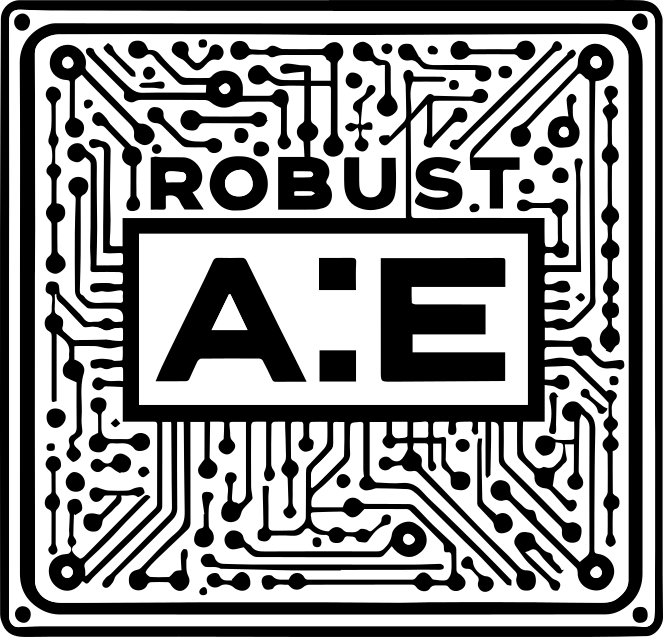

Robust AE Ltd is an electrical engineering and embedded systems consultancy based in South Croydon. The work spans embedded firmware, FPGA logic, industrial control programming, and the electrical infrastructure those systems run in. The company is run by George Haworth, MIET.

- **Embedded systems.** Firmware on microcontrollers, primarily Rust on Cortex-M.
- **FPGA development.** Verilog RTL targeting Xilinx Artix-7, using the openXC7 open-source toolchain.
- **IEC 61131-3 programming.** Industrial control logic in Siemens TIA Portal (SCL) and CODESYS.
- **Electrical engineering.** Control panel design and build to BS EN 61439, installation work to BS 7671.

Email enquiries to [info@robust-ae.com](mailto:info@robust-ae.com) with a specific technical question. The working portfolio at [github.com/ghaworth](https://github.com/ghaworth) is worth a look first.

---

Robust AE Ltd, 8 Spencer Road, South Croydon, CR2 7EH. Registered in England, company no. 11269142. VAT GB 373106711.